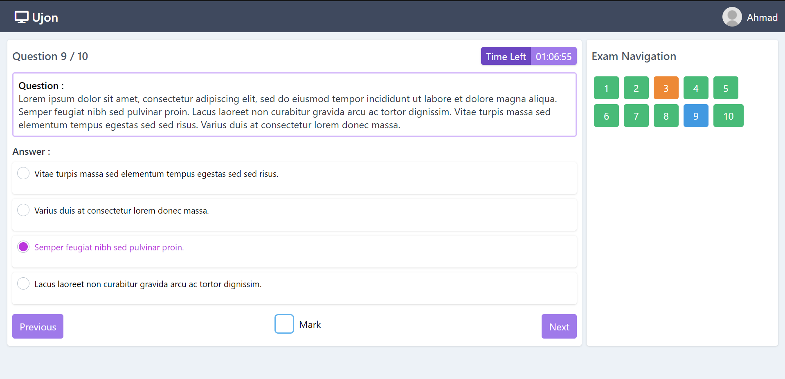
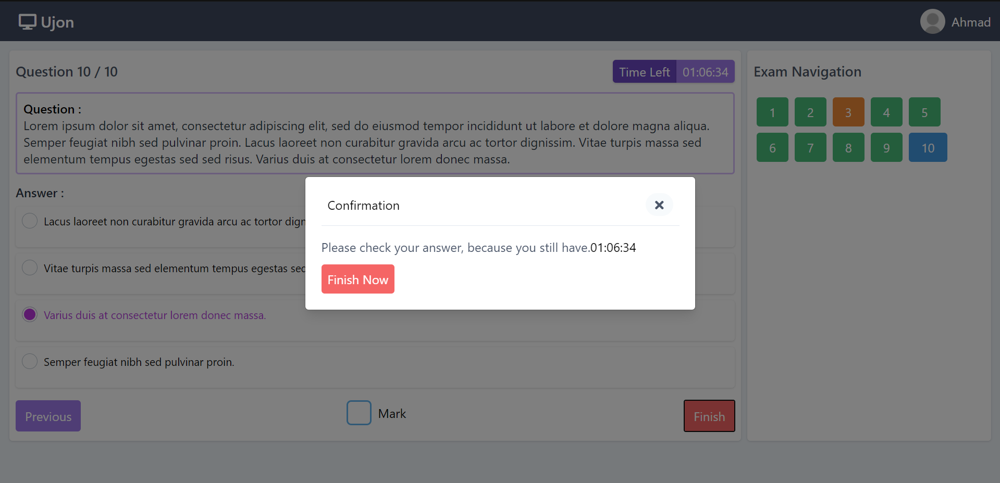
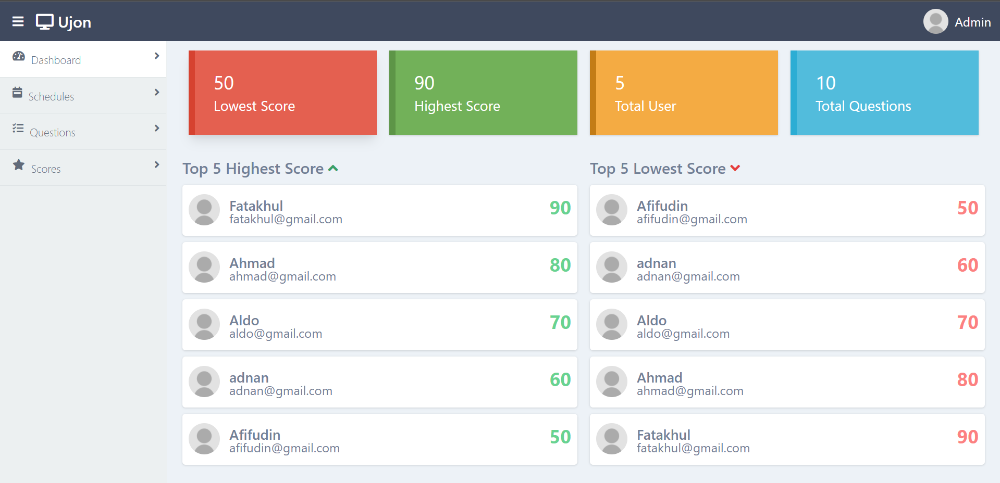
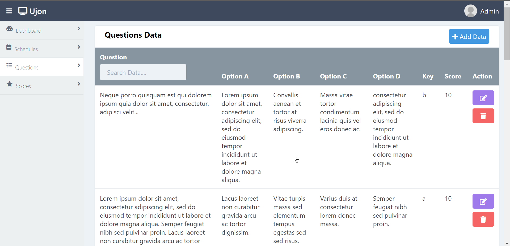

## Usage Application
> Web-based application used to conduct online exams.

## How to run project
1. yarn install / npm install
2. yarn start / npm start

## Screenshots

  
  
  
  

## Application Features
- Login
- Register (member)
- Manage Schedule and Question
- Show Highest and Lowest Score
- Timer to Do Exam
- Timer to Start Exam

## Framework & Libraries
- React JS
- Laravel (Backend)
- Tailwind CSS
- Redux

## API
[https://github.com/afi11/api_ujian_online](https://github.com/afi11/api_ujian_online)
